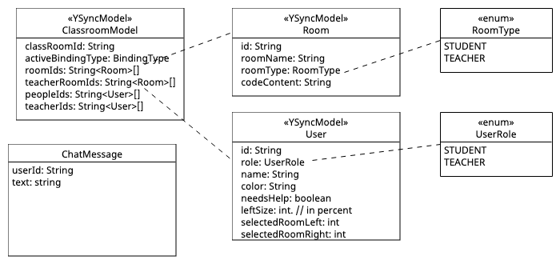

# Cocoding Classroom - high level architecture

## Technology
Cocoding Classroom (cc-II) relies on a couple of third-party technologies:

### Core dependencies
* **nodejs** – Server to run


### Development dependendencies
* **[npm](https://www.npmjs.com/)** – Package (and project) manager. 
* **[prettier](https://prettier.io/)** – Code formatter
* **[process]()** – TODO: is this required?
* **[webpack](https://webpack.js.org/)** – Bundler for web deployment. 

### Libraries
Only relevant libraries are listed here. The full list of dependencies can be found in [package.json](../package.json)
* **[Yjs](https://yjs.dev/)** – Yjs is a shared editing framework based on the [CRDT algorithm](https://github.com/yjs/yjs/blob/master/README.md#Yjs-CRDT-Algorithm). It exposes Shared Types that can be manipulated like any other data type. But they are synced automatically! 
  Allmost all entities in cc-II are sychronized through Yjs.
* **[ACE editor](https://ace.c9.io/)** – embeddable code editor in Javascript
* **[Lit](https://lit.dev/)** – Fast, lightweight, reactive framework for building web components that work just about anywhere. No precompiling required.
* **[js-beautify](https://beautifier.io/)** – Code beautyfier to cleanup code edited in the ACE editor.

## File Structure

The code is divided into the following core modules:
* **./src/assets/** – non-code assets like images, movies, etc. 
* **./src/bindings/** – bindings for different backends (p5js, hydra, etc.)
* **./src/components/** – view-related components, everything that is rendered in the browser should go into this folder
* **./src/models/** – data models that are use locally or synchronised through Yjs. 
* **./src/services/** – Services provide the logic to glue the system. They are called by the components or other services and do have access to the data models.
* **./src/util/** – Generic utility modules

## Modules
All code is structured in [Javascript modules](https://developer.mozilla.org/en-US/docs/Web/JavaScript/Guide/Modules). The modules of cc-II embrace some rules.

### Models
The following diagram shows the core components of the cc-II datamodel.


The model classes are synched between all clients through YSync. 
If a model class extends from YSyncModel ([`y-sync-models.js`](../src/models/y-sync-model.js)) 
all its properties are synchronised automatically. The following snippet outlines this approach.

```javascript
import { YSyncModel } from "/src/models/y-sync-model.js";
import * as Y from "yjs";
import { BindingType } from "./classroom-model";
import { BindingService } from "../services/binding-service";

export class Room extends YSyncModel {
  id;                 // these properties are synchronised
  roomName;
  codeContent;
  l_changedPositions; // properties with l_-prefix will not be synched (l_ = local)
  //...
  
  // use the constructor to initialize the properties
  constructor(id) {
    super(`room_${id}`);   // name of the map to be synced for this object
    this.id = id;
    this.setup();          // call setup to initialize synching
    
    // you may setup dynamic Y-synching
    if (this.codeContent === null || this.codeContent === undefined) {
      let activeBinding = BindingService.get().binding;
      this.codeContent = new Y.Text(activeBinding.getCodeTemplate() ?? "");
    }
    this.l_changedPositions = [];
  }
}
```

### View Components
Components are responsible to render the view parts of the UI. They rely on the [Lit-Framework](https://lit.dev/). Each cc-II view component extends from [LitElement](https://lit.dev/docs/api/LitElement/). 

This provides access to the Lit **lifecycle** methods. In the LitElement class, the following lifecycle methods are available (list generated by ChatGPT):
* `constructor()`: This method is called when an instance of the component is created.
* `connectedCallback()`: This method is called when the component is added to the DOM.
* `disconnectedCallback()`: This method is called when the component is removed from the DOM.
* `attributeChangedCallback(name, oldValue, newValue)`: This method is called when an attribute of the component changes.
* `shouldUpdate(changedProperties)`: This method is called to determine if the component should update.
* `update(changedProperties)`: This method is called when the component should update.
* `firstUpdated(changedProperties)`: This method is is called after the component has been updated for the first time.
* `render()`: This method is called to render the component's template.

These lifecycle methods provide hooks for developers to respond to changes in the component's state and the DOM. By overriding these methods, developers can customize the behavior of their web components.

**Properties** can be defined using a static field called `static properties = { prop: { <prop_cfg> }}`. For `<prop_cfg>` you can use (by ChatGPT):
* `type`: The type of the property. This can be any JavaScript primitive type, such as String, Number, Boolean, or Object.
* `attribute`: The name of the HTML attribute that corresponds to the property. By default, this is the property name in kebab-case.
* `reflect`: A boolean indicating whether the property should be reflected to the corresponding HTML attribute.
* `hasChanged`: A method that is called when the property changes. This method should return a boolean indicating whether the property has actually changed.
* `converter`: A function that is used to convert the property value from a string to the desired type.
* `state`: A boolean indicating whether the property is part of the component's internal state.

Custom **CSS** can be defined through property ``static styles=css` ` ``

```javascript
import { css, html, LitElement } from "lit";

export class RoomView extends LitElement {
  static properties = {
    roomId: { type: Number },
    width: { type: Number },
    isLeft: { type: Number },
    binding: { type: Object, state: true },
  };

  render() {
    return html`
      <cc-frame
        class="frame"
        roomId="${this.roomId}"
        frameWidth="${this.width}"
        leftAlign="${this.isLeft}"
      ></cc-frame>
      <cc-editor
        class="editor"
        roomId="${this.roomId}"
        editorWidth="${this.width}"
        leftAlign="${this.isLeft}"
      >
      </cc-editor>
    `;
  }

  static styles = css``;
} 
```

Finally, the view elements has to be registered as custom HTML element.
```javascript
window.customElements.define("cc-room", RoomView);
```

### Service
Services serve several tasks:
* **Data services** They are responsible to instanciate and propagate the `models`. Check [user-service.js](../src/services/user-service.js) as a sample data service.
* **Utility services** provide business logic (such as in [sync-service.js](../src/services/sync-service.js)) or act as abstraction layer for concrete implementations (such as in [binding-service.js](../src/services/binding-service.js)). The distinction between what should be exposed as a service and what belongs to the `util`-folder is not always clear. 

Services should follow the **singelton-pattern**. Use ``service.get()`` to obtain a reference to a service. When implementing a new service, copy the 'get()"-logic from an existing service. 

### Util
Collection of static utility functions and some utility classes, which have not been transformed to a service-class yet. 

### Binding
see [binding.md](binding.md)

## Shortcuts

